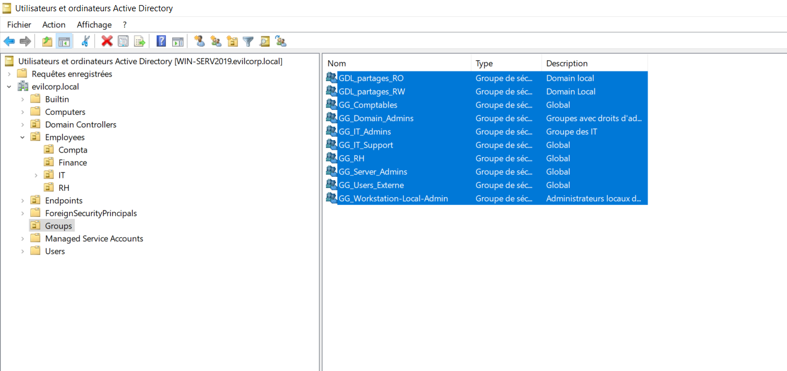

# 02 - Group Creation

## 📖 Objectif

Cette étape consiste à créer les groupes de sécurité qui seront utilisés pour appliquer le modèle **AGDLP (Accounts → Global Groups → Domain Local Groups → Permissions)**.

Les groupes sont organisés selon leur rôle :

- Les **Global Groups (GG)** regroupent les utilisateurs ayant les mêmes responsabilités.
- Les **Domain Local Groups (GDL)** représentent les niveaux d'accès qui seront appliqués aux ressources.

Cette approche permet de simplifier l'administration des droits tout en respectant les recommandations Microsoft.

---

## 🎯 Objectifs de cette étape

- Créer les **Global Groups**.
- Créer les **Domain Local Groups**.
- Préparer l'attribution des permissions sur le partage SMB.
- Mettre en place une structure évolutive et facile à administrer.

---

## 👥 Global Groups

Les groupes globaux permettent de regrouper les utilisateurs ayant les mêmes fonctions.

| Groupe | Description |
|---------|-------------|
| **GG_Comptables** | Regroupe les utilisateurs du service Comptabilité. |
| **GG_Users_Externe** | Regroupe les utilisateurs externes disposant d'un accès limité. |

---

## 🔒 Domain Local Groups

Les groupes locaux de domaine sont utilisés pour attribuer les permissions sur les ressources.

| Groupe | Permission prévue |
|---------|-------------------|
| **GDL_Partages_RW** | Lecture / Écriture |
| **GDL_Partages_RO** | Lecture seule |

---

## 🏗️ Architecture des groupes

```text
Global Groups (GG)

GG_Comptables

GG_Users_Externe


        │

        ▼

Domain Local Groups (GDL)

GDL_Partages_RW

GDL_Partages_RO
```

### Vérification dans Active Directory Users and Computers



---

## ✅ Résultat

À l'issue de cette étape :

- Les **Global Groups** ont été créés.
- Les **Domain Local Groups** ont été créés.
- La structure de groupes est prête pour l'implémentation du modèle **AGDLP**.
- Les permissions ne sont pas encore attribuées ; elles seront configurées dans les étapes suivantes.

---

## ➡️ Étape suivante

La prochaine étape consiste à implémenter le modèle **AGDLP** en :

- ajoutant les utilisateurs aux **Global Groups** ;
- intégrant les **Global Groups** dans les **Domain Local Groups**.

→ **03-AGDLP-Implementation**
