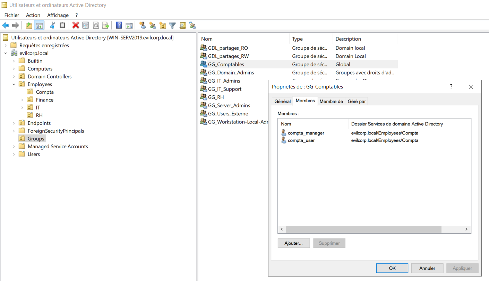
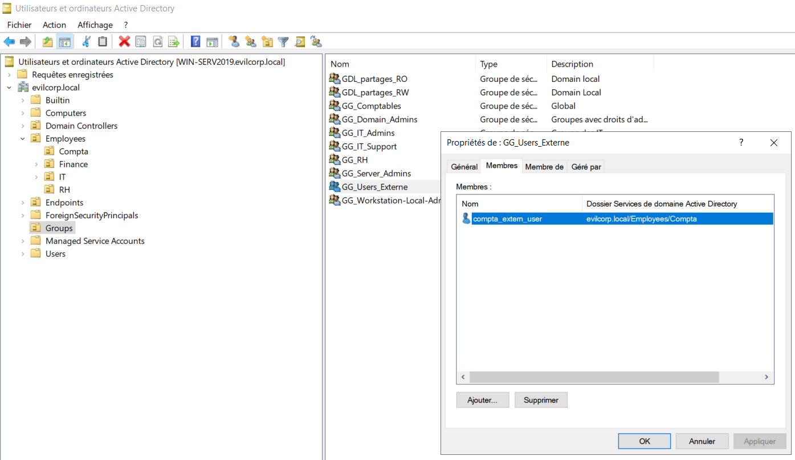
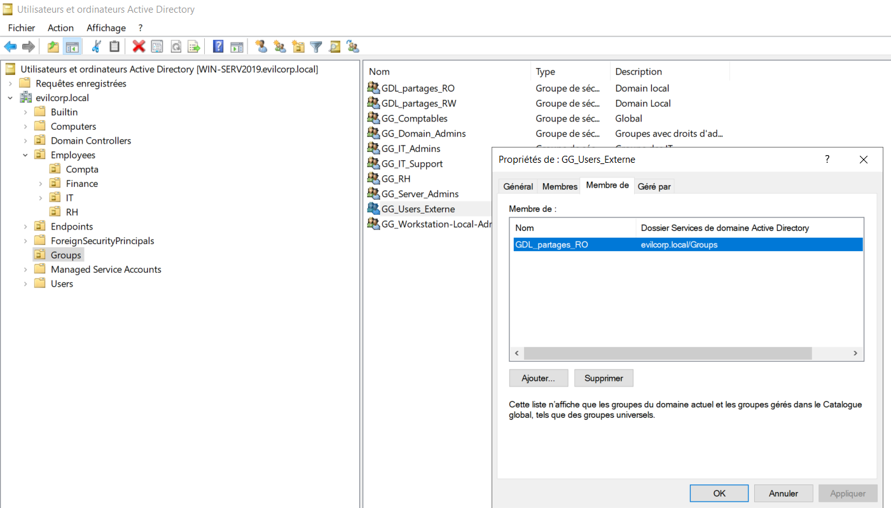

# 03 - AGDLP Implementation

## 📖 Objectif

Cette étape consiste à mettre en œuvre le modèle **AGDLP (Accounts → Global Groups → Domain Local Groups → Permissions)** en associant les utilisateurs aux groupes appropriés.

Conformément aux bonnes pratiques Microsoft, les utilisateurs ne reçoivent jamais directement des permissions sur les ressources. Ils sont d'abord intégrés dans des **Global Groups (GG)**, qui sont ensuite membres des **Domain Local Groups (GDL)**. Les permissions seront attribuées uniquement aux **Domain Local Groups** lors des prochaines étapes.

Cette méthode facilite l'administration des droits d'accès, améliore la lisibilité de l'infrastructure et simplifie les futures évolutions.

---

## 🎯 Objectifs de cette étape

- Ajouter les utilisateurs dans les **Global Groups**.
- Intégrer les **Global Groups** dans les **Domain Local Groups**.
- Implémenter le modèle AGDLP.
- Préparer l'attribution des permissions sur le partage SMB.

---

## 👥 Affectation des utilisateurs aux Global Groups

Les utilisateurs sont regroupés selon leur fonction.

| Utilisateur | Global Group |
|-------------|--------------|
| **compta_manager** | GG_Comptables |
| **compta_user** | GG_Comptables |
| **compta_extern_user** | GG_Users_Externe |

---

## 🔒 Intégration des Global Groups dans les Domain Local Groups

Les groupes globaux sont ensuite intégrés aux groupes locaux de domaine qui recevront les permissions sur les ressources.

| Global Group | Domain Local Group |
|--------------|--------------------|
| **GG_Comptables** | GDL_Partages_RW |
| **GG_Users_Externe** | GDL_Partages_RO |

---

## 🏗️ Implémentation du modèle AGDLP

```text
                    AGDLP

Accounts
│
├── compta_manager
├── compta_user
└── compta_extern_user
        │
        ▼
Global Groups
│
├── GG_Comptables
└── GG_Users_Externe
        │
        ▼
Domain Local Groups
│
├── GDL_Partages_RW
└── GDL_Partages_RO
        │
        ▼
Permissions (Étape suivante)
```

---

### Vérification des appartenances aux groupes






---

## ✅ Résultat

À l'issue de cette étape :

- Les utilisateurs ont été intégrés dans leurs **Global Groups** respectifs.
- Les **Global Groups** ont été ajoutés aux **Domain Local Groups**.
- Le modèle **AGDLP** est correctement implémenté.
- L'environnement est prêt pour l'attribution des permissions sur le partage SMB.

---

## ➡️ Étape suivante

La prochaine étape consiste à créer le partage réseau SMB qui sera utilisé pour appliquer les permissions définies par le modèle AGDLP.

→ **04-SMB-Share-Creation**

