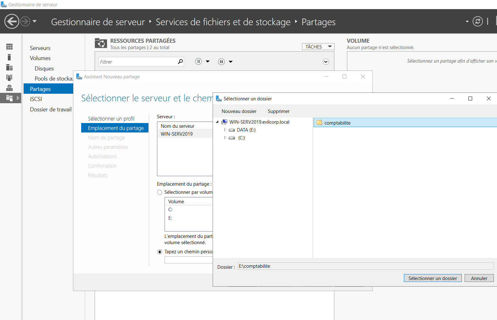
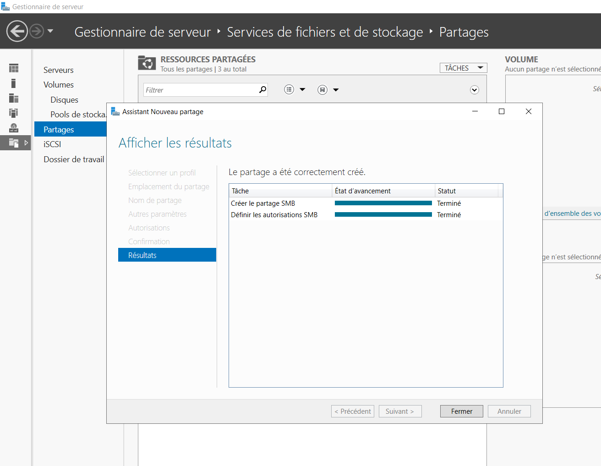
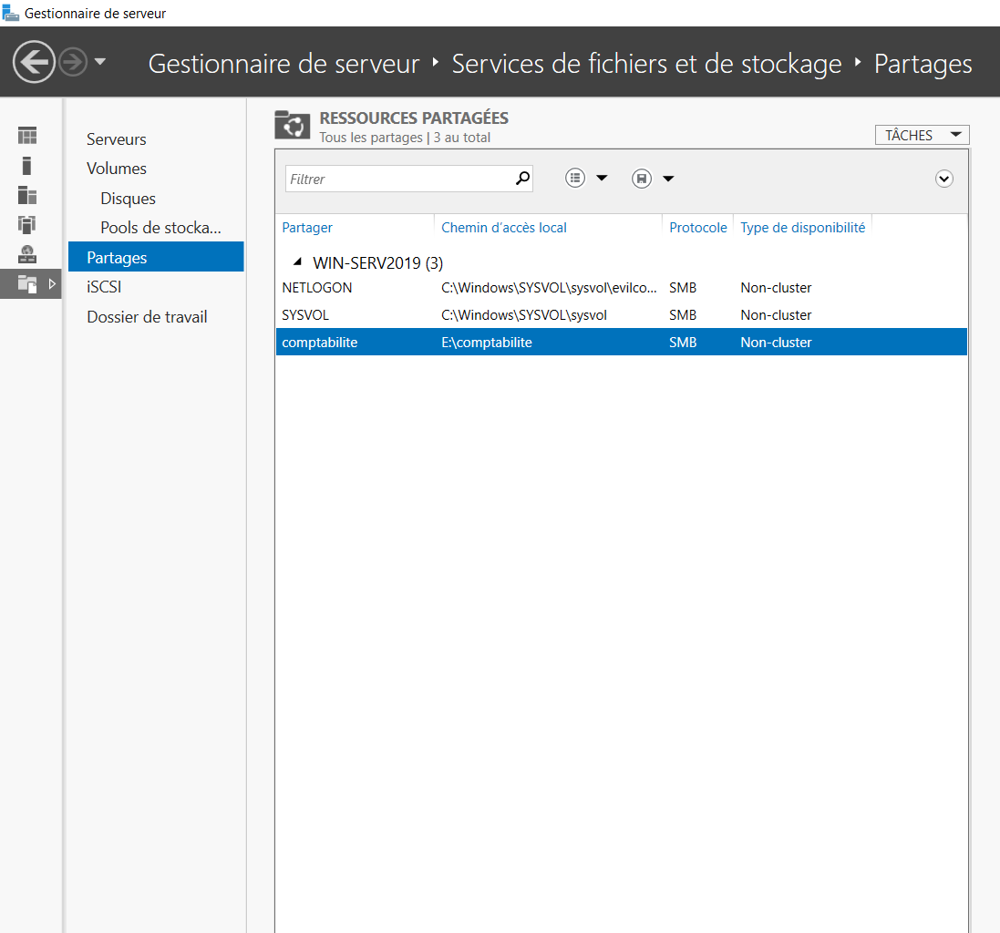

# 04 - SMB Share Creation

## 📖 Objectif

Cette étape consiste à créer le dossier qui servira de ressource partagée, puis à le publier en tant que **partage SMB**.

Le partage réseau permettra aux utilisateurs d'accéder aux fichiers selon les permissions qui seront configurées lors de l'étape suivante. À ce stade, l'objectif est uniquement de rendre la ressource accessible sur le réseau.

---

## 🎯 Objectifs de cette étape

- Créer le dossier destiné au partage.
- Publier le dossier en tant que partage SMB.
- Définir le nom du partage.
- Préparer l'attribution des permissions de partage et des permissions NTFS.

---

## 📂 Création du dossier partagé

Le dossier **Compta** est créé sur le serveur Windows afin d'héberger les fichiers du service Comptabilité.

| Élément | Valeur |
|---------|--------|
| Nom du dossier | Compta |
| Type | Dossier partagé |
| Serveur | WIN-SERV2019 |

---

## 🌐 Configuration du partage SMB

Le dossier est publié via le protocole **SMB (Server Message Block)** afin de permettre son accès depuis les postes du domaine.

| Paramètre | Valeur |
|-----------|--------|
| Nom du partage | Compta |
| Protocole | SMB |
| Ressource | Dossier Compta |

---

## 🏗️ Architecture du partage

```text
WIN-SERV2019
│
└── Dossier : Compta
        │
        ▼
Partage SMB
        │
        ▼
\\WIN-SERV2019\Comptabilité
```

---

## 📸 Vérification dans Windows Server

### Création du dossier



---

### Configuration du partage SMB



---

### Vérification du partage



---

## ✅ Résultat

À l'issue de cette étape :

- Le dossier **Compta** a été créé sur le serveur.
- Le dossier est publié en tant que **partage SMB**.
- Le partage est accessible via le chemin réseau :

```text
\\WIN-SERV2019\Compta
```

- L'environnement est prêt pour la configuration des permissions de partage et des permissions NTFS.

---

## ➡️ Étape suivante

La prochaine étape consiste à configurer les **permissions de partage** et les **permissions NTFS** afin de contrôler précisément les droits d'accès au dossier partagé.

→ **05-Share-and-NTFS-Permissions**

