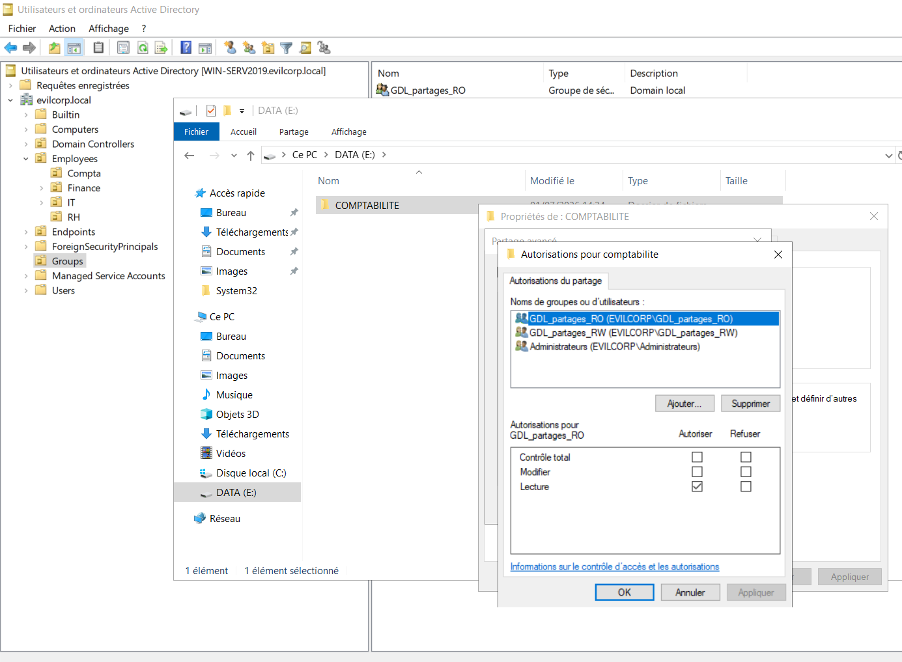
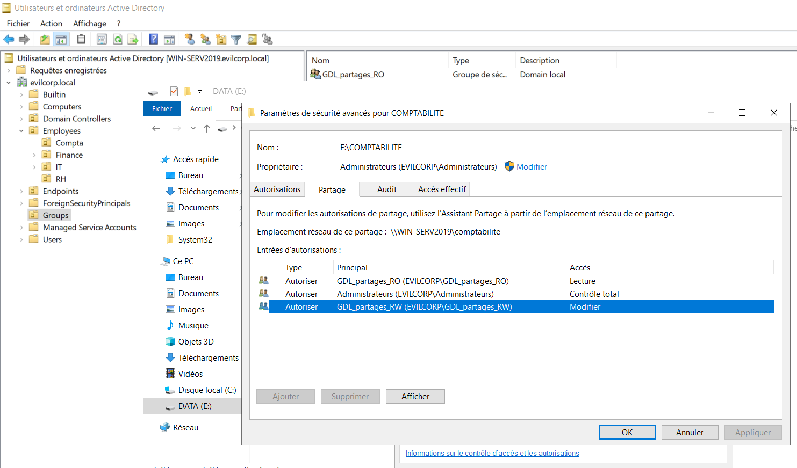

# 05 - Share and NTFS Permissions

## 📖 Objectif

Cette étape consiste à configurer les **permissions de partage (Share Permissions)** ainsi que les **permissions NTFS** du dossier partagé.

Les autorisations sont attribuées exclusivement aux **Domain Local Groups (GDL)** conformément au modèle **AGDLP**. Cette approche facilite l'administration des droits d'accès et garantit une gestion centralisée des permissions.

---

## 🎯 Objectifs de cette étape

- Configurer les permissions de partage SMB.
- Configurer les permissions NTFS.
- Appliquer le principe du moindre privilège.
- Attribuer les permissions aux **Domain Local Groups**.
- Préparer la validation des accès utilisateurs.

---

## 🌐 Configuration des permissions de partage (Share Permissions)

Les permissions de partage déterminent les droits accordés aux utilisateurs lorsqu'ils accèdent au dossier via le réseau.

Les autorisations sont attribuées aux groupes suivants :

| Groupe | Permission |
|---------|------------|
| **GDL_Partages_RW** | Lecture / Modification |
| **GDL_Partages_RO** | Lecture |

> Les utilisateurs ne reçoivent aucune permission directement. L'accès est entièrement géré par les groupes de sécurité.

---

## 🔒 Configuration des permissions NTFS

Les permissions NTFS contrôlent les actions autorisées sur les fichiers et dossiers stockés sur le serveur.

Les permissions sont configurées comme suit :

| Groupe | Permission |
|---------|------------|
| **Administrators** | Contrôle total |
| **SYSTEM** | Contrôle total |
| **GDL_Partages_RW** | Modification |
| **GDL_Partages_RO** | Lecture et exécution |

Cette configuration applique le **principe du moindre privilège**, en accordant uniquement les droits nécessaires à chaque groupe.

---

## 🏗️ Modèle d'attribution des permissions

```text
                    AGDLP

Accounts
        │
        ▼
Global Groups (GG)
        │
        ▼
Domain Local Groups (GDL)
        │
        ▼
Share Permissions
        │
        ▼
NTFS Permissions
        │
        ▼
\\WIN-SERV2019\Compta
```

---

## 📸 Vérification dans Windows Server

### Permissions de partage



---

### Permissions NTFS



---

## ✅ Résultat

À l'issue de cette étape :

- Les permissions de partage SMB ont été configurées.
- Les permissions NTFS ont été appliquées.
- Les autorisations sont attribuées uniquement aux **Domain Local Groups**.
- L'environnement respecte le modèle **AGDLP** ainsi que le principe du moindre privilège.
- Le partage est prêt à être testé avec les différents comptes utilisateurs.

---

## ➡️ Étape suivante

La prochaine étape consiste à vérifier que les permissions sont correctement appliquées en testant les différents niveaux d'accès avec les comptes utilisateurs.

→ **06-Permission-Validation**
