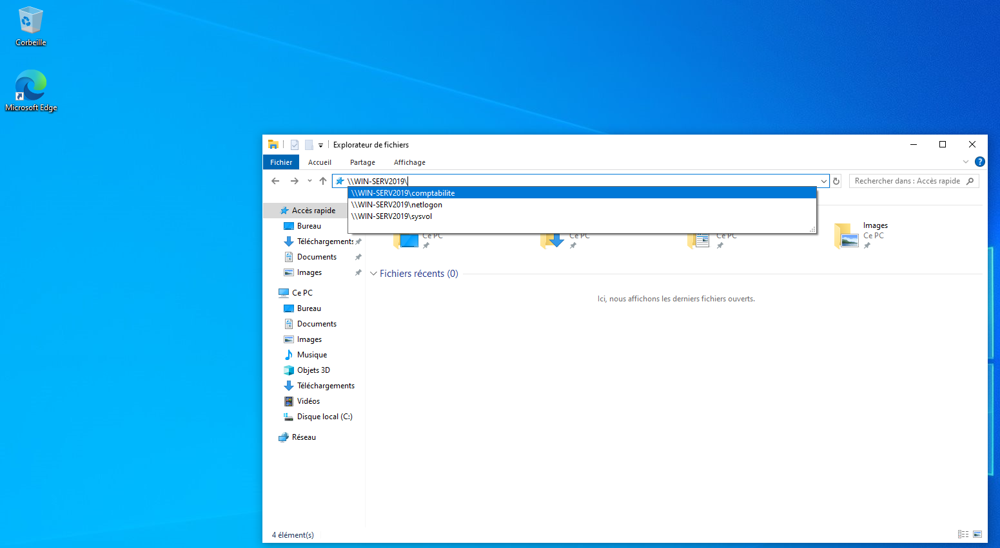
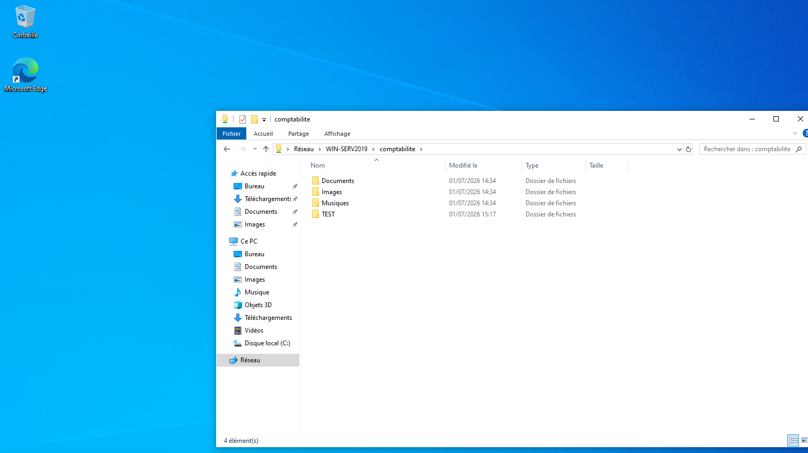

# 06 - Permission Validation

## 📖 Objectif

Cette étape consiste à vérifier que les permissions configurées lors des étapes précédentes sont correctement appliquées.

Les tests sont réalisés avec différents comptes utilisateurs afin de confirmer que les autorisations sont héritées via le modèle **AGDLP** et qu'aucune permission n'est attribuée directement aux utilisateurs.

---

## 🎯 Objectifs de cette étape

- Vérifier les permissions de lecture.
- Vérifier les permissions d'écriture.
- Vérifier les permissions de suppression.
- Confirmer le bon fonctionnement du modèle AGDLP.
- Valider les permissions de partage et les permissions NTFS.

---

## 🧪 Comptes utilisés

| Utilisateur | Groupe Global | Groupe Local | Accès attendu |
|-------------|---------------|--------------|---------------|
| **compta_manager** | GG_Comptables | GDL_Partages_RW | Lecture / Écriture |
| **compta_user** | GG_Comptables | GDL_Partages_RW | Lecture / Écriture |
| **compta_extern_user** | GG_Users_Externe | GDL_Partages_RO | Lecture seule |

---

## ✔️ Validation des accès

Les opérations suivantes ont été testées pour chaque utilisateur :

- Ouverture du partage SMB.
- Lecture des fichiers.
- Création d'un dossier.
- Création d'un fichier.
- Modification d'un fichier.
- Suppression d'un fichier.

---

## 📊 Résultats

| Utilisateur | Lecture | Écriture | Suppression |
|-------------|:--------:|:---------:|:-----------:|
| **compta_manager** | ✅ | ✅ | ✅ |
| **compta_user** | ✅ | ✅ | ✅ |
| **compta_extern_user** | ✅ | ❌ | ❌ |

---

## 🏗️ Validation du modèle AGDLP

Les tests confirment que les permissions sont appliquées conformément au modèle AGDLP.

```text
compta_manager
        │
        ▼
GG_Comptables
        │
        ▼
GDL_Partages_RW
        │
        ▼
Permissions SMB + NTFS
        │
        ▼
Lecture / Écriture
```

```text
compta_extern_user
        │
        ▼
GG_Users_Externe
        │
        ▼
GDL_Partages_RO
        │
        ▼
Permissions SMB + NTFS
        │
        ▼
Lecture seule
```

---

## 📸 Vérification

### Test avec **compta_manager**





---


## ✅ Résultat

Les tests confirment que :

- Les permissions sont correctement héritées via les groupes de sécurité.
- Les membres du groupe **GDL_Partages_RW** disposent des droits de lecture et d'écriture.
- Les membres du groupe **GDL_Partages_RO** disposent uniquement d'un accès en lecture.
- Aucune permission n'est attribuée directement aux utilisateurs.
- Le modèle **AGDLP** est correctement mis en œuvre et fonctionne comme prévu.

---

## ➡️ Étape suivante

L'environnement étant désormais entièrement configuré et validé, la prochaine étape consiste à l'analyser du point de vue d'un attaquant.

La partie **Pentest** portera notamment sur :

- Reconnaissance SMB.
- Énumération Active Directory.
- Identification des utilisateurs et des groupes.
- Analyse des partages SMB.
- Validation des permissions.
- Vérification du modèle AGDLP.
- Analyse des résultats dans une démarche SOC.

→ **07-Pentest**
