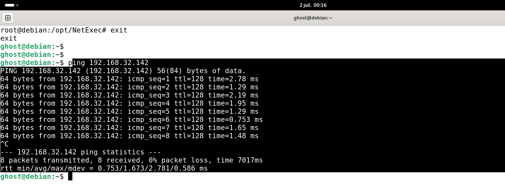
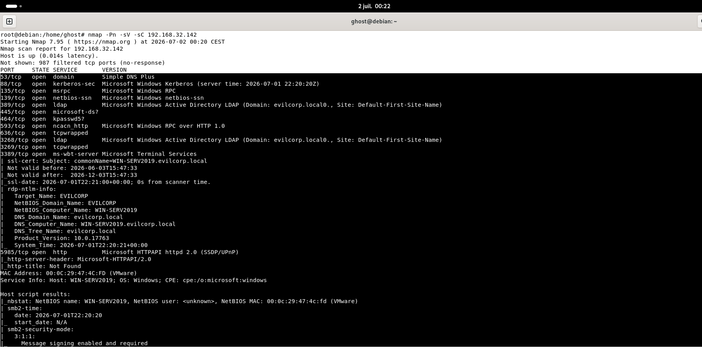

# 01 - Reconnaissance

## 📖 Objectif

La phase de reconnaissance constitue la première étape d'une évaluation de sécurité. Son objectif est d'identifier les systèmes présents sur le réseau, les services exposés et les points d'entrée potentiels avant toute tentative d'énumération.

Dans ce laboratoire, la reconnaissance est réalisée depuis une machine **Debian** afin d'identifier les services accessibles sur le contrôleur de domaine **Windows Server 2019** hébergeant le domaine **evilcorp.local**.

---

## 🎯 Objectifs de cette étape

- Vérifier l'accessibilité de la cible.
- Identifier les ports ouverts.
- Détecter les services exposés.
- Identifier le système d'exploitation.
- Déterminer les services liés à Active Directory.

---

## 🎯 Cible

| Élément | Valeur |
|---------|--------|
| Adresse IP | 192.168.32.142 |
| Nom d'hôte | WIN-SERV2019 |
| Domaine | evilcorp.local |
| Système | Windows Server 2019 |

---

## 🔍 Reconnaissance réseau

La première étape consiste à vérifier que la cible est joignable.

```bash
ping 192.168.32.142
```

Cette commande permet de confirmer la connectivité réseau avant de lancer des analyses plus approfondies.

---

## 🔎 Découverte des services

Une analyse des ports est ensuite réalisée afin d'identifier les services accessibles.

```bash
nmap -Pn -sV -sC 192.168.32.142
```

### Description des options

| Option | Description |
|---------|-------------|
| `-Pn` | Ignore la découverte d'hôte (Ping Scan). |
| `-sV` | Détecte les versions des services. |
| `-sC` | Exécute les scripts NSE par défaut. |

---

## 📌 Services attendus

| Port | Service |
|------|---------|
| 53 | DNS |
| 88 | Kerberos |
| 135 | RPC |
| 139 | NetBIOS |
| 389 | LDAP |
| 445 | SMB |
| 464 | Kerberos Password Change |
| 593 | RPC over HTTP |

La présence de ces services confirme que la machine cible est un contrôleur de domaine Active Directory.

---

## 📸 Captures d'écran

### Vérification de la connectivité



---

### Scan Nmap



---

## 📝 Analyse Pentest

Les résultats montrent que la cible expose plusieurs services caractéristiques d'un contrôleur de domaine Active Directory.

La présence des services **DNS**, **Kerberos**, **LDAP** et **SMB** indique qu'il sera possible de poursuivre l'évaluation en réalisant une énumération des ressources accessibles.

À ce stade, aucune tentative d'authentification ou d'accès aux ressources n'a encore été effectuée.

---

# 🛡️ Analyse SOC

## Cyber Kill Chain

| Phase | État |
|--------|------|
| Reconnaissance | ✅ En cours |

L'attaquant collecte des informations sur la cible sans interagir avec les ressources protégées.

---

## MITRE ATT&CK

| Tactique | Technique |
|-----------|-----------|
| Reconnaissance | **T1595 - Active Scanning** |

L'utilisation de **Nmap** permet d'identifier les services exposés et de préparer les étapes suivantes de l'attaque.

---

## Pyramid of Pain

| Niveau | Observation |
|---------|-------------|
| Network / Host Artifacts | Détection d'un scan de ports provenant d'une même adresse IP. |

Cette activité est relativement simple à détecter grâce aux journaux réseau.

---

## Sources de journalisation

Les activités de reconnaissance peuvent être observées à l'aide des journaux suivants :

- Firewall
- IDS / IPS
- SIEM
- Journaux Windows Defender Firewall
- Capture réseau (Wireshark)
- Suricata / Zeek (si déployés)

---

## Indicateurs de compromission (IoC)

- Multiples connexions TCP provenant d'une même adresse IP.
- Scan rapide de plusieurs ports.
- Tentatives de découverte des services réseau.
- Analyse des versions des services.

---

## Recommandations SOC

- Surveiller les scans de ports.
- Détecter les connexions successives vers plusieurs services.
- Corréler les événements provenant du pare-feu et des systèmes IDS/IPS.
- Générer une alerte lorsqu'un hôte effectue un balayage de ports sur un serveur critique.

---

## ✅ Résultat

À l'issue de cette étape :

- La connectivité réseau a été validée.
- Les principaux ports ouverts ont été identifiés.
- Les services Active Directory ont été détectés.
- La phase de reconnaissance est terminée.
- L'environnement est prêt pour l'énumération SMB.

---

## ➡️ Étape suivante

La prochaine étape consiste à effectuer une **énumération SMB** afin d'identifier les partages disponibles, les informations accessibles et les éventuelles permissions accordées.

→ **02-SMB-Enumeration**
