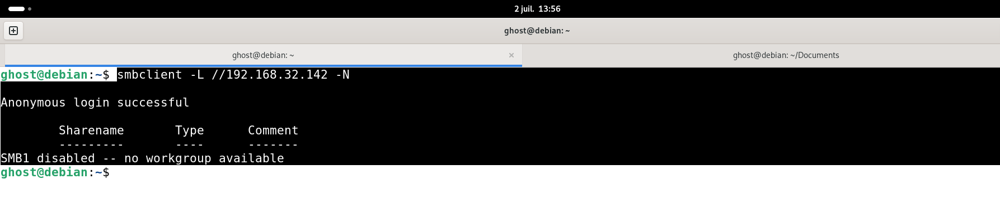
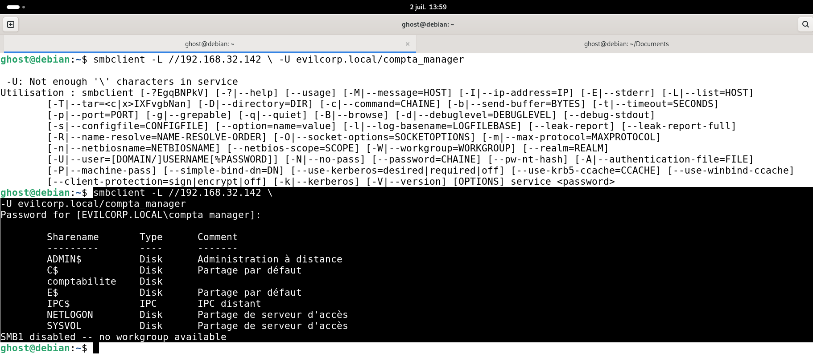
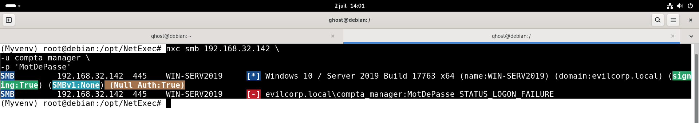
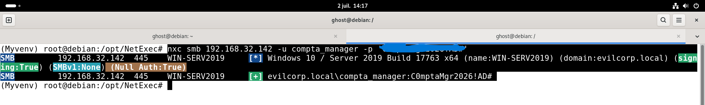
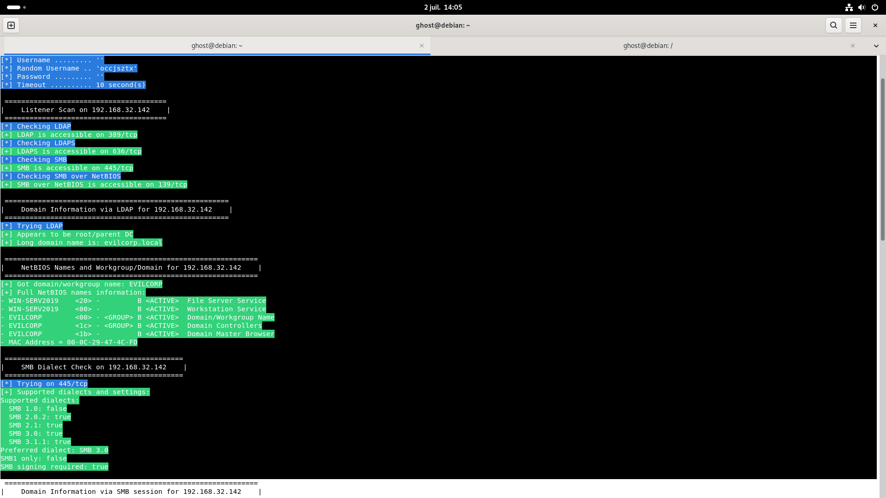
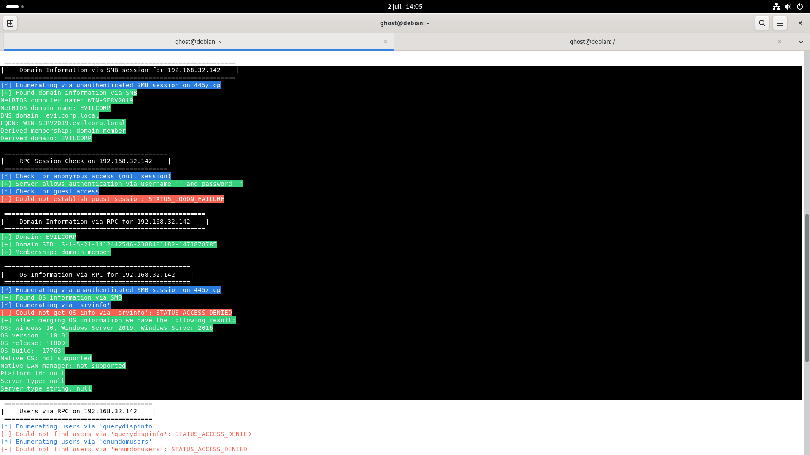
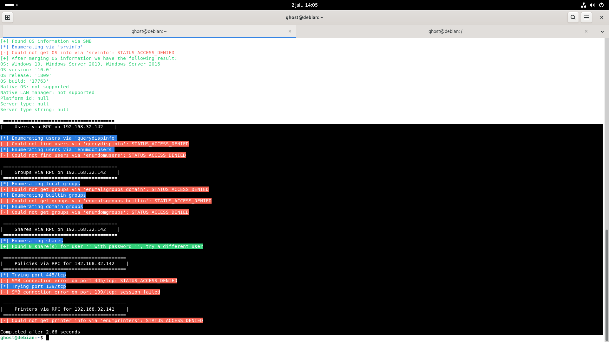
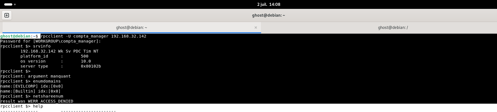

# 02 - SMB Enumeration

## 📖 Objectif

Cette étape consiste à énumérer le service **SMB (Server Message Block)** afin d'identifier les ressources accessibles sur le contrôleur de domaine, de vérifier les mécanismes de sécurité activés et d'évaluer les informations pouvant être obtenues avec ou sans authentification.

L'objectif est également de préparer les phases suivantes d'énumération du domaine Active Directory.

---

## 🎯 Objectifs de cette étape

- Vérifier l'accès anonyme au service SMB.
- Énumérer les partages accessibles.
- Identifier les mécanismes de sécurité SMB.
- Valider l'authentification avec un compte du domaine.
- Collecter les informations utiles pour la suite du Pentest.

---

# 🎯 Cible

| Élément | Valeur |
|---------|--------|
| Adresse IP | 192.168.32.142 |
| Nom d'hôte | WIN-SERV2019 |
| Domaine | evilcorp.local |
| Service | SMB (445/TCP) |

---

# 🔍 Énumération anonyme

Une première tentative est réalisée sans fournir d'identifiants.

```bash
smbclient -L //192.168.32.142 -N
```

### Résultat

- Authentification anonyme autorisée.
- Aucun partage accessible.
- SMBv1 désactivé.

### Capture



---

# 🔐 Énumération authentifiée

Une seconde énumération est réalisée avec le compte **compta_manager**.

```bash
smbclient -L //192.168.32.142 \
-U evilcorp.local/compta_manager
```

### Partages découverts

| Partage | Description |
|---------|-------------|
| ADMIN$ | Partage d'administration |
| C$ | Partage administratif |
| E$ | Partage administratif |
| comptabilite | Partage créé dans le laboratoire |
| IPC$ | Communication inter-processus |
| NETLOGON | Scripts de connexion Active Directory |
| SYSVOL | Réplication des stratégies de groupe |

### Capture



---

# 🔍 Identification du serveur SMB

Une analyse complémentaire est réalisée avec **NetExec**.

```bash
nxc smb 192.168.32.142 \
-u compta_manager \
-p '********'
```

### Informations obtenues

| Élément | Valeur |
|---------|--------|
| Système | Windows Server 2019 |
| Build | 17763 |
| Domaine | evilcorp.local |
| Signature SMB | Activée |
| SMBv1 | Désactivé |
| Null Session | Autorisée |
| Authentification | Réussie |

### Capture




---

# 🔍 Énumération complémentaire

Une analyse supplémentaire est réalisée avec **enum4linux-ng**.

```bash
enum4linux-ng 192.168.32.142
```

### Informations découvertes

- Domaine Active Directory : **evilcorp.local**
- Nom NetBIOS : **EVILCORP**
- Contrôleur de domaine : **WIN-SERV2019**
- LDAP accessible (389/TCP)
- LDAPS accessible (636/TCP)
- SMB accessible (445/TCP)
- NetBIOS accessible (139/TCP)

### Configuration SMB

| Élément | État |
|---------|------|
| SMBv1 | Désactivé |
| SMBv2 | Activé |
| SMBv3 | Activé |
| Signature SMB | Obligatoire |

### Observations

L'outil confirme également :

- Présence d'une **Null Session**.
- Refus d'accès lors de l'énumération des utilisateurs.
- Refus d'accès lors de l'énumération des groupes.
- Refus d'accès lors de l'énumération des partages RPC.

Ces résultats montrent que le contrôleur de domaine autorise une session anonyme mais limite correctement les informations accessibles sans authentification.

### Capture






---

# 🔍 Validation via RPC

Une connexion RPC authentifiée est ensuite réalisée.

```bash
rpcclient -U compta_manager 192.168.32.142
```

### Commandes exécutées

```text
srvinfo
enumdomains
netshareenum
```

### Résultats

| Commande | Résultat |
|----------|----------|
| srvinfo | Informations système obtenues |
| enumdomains | Domaines EVILCORP et Builtin découverts |
| netshareenum | Accès refusé (WERR_ACCESS_DENIED) |

### Capture



---

# 📝 Analyse Pentest

L'énumération SMB confirme que le contrôleur de domaine est correctement identifié et que les principaux services Active Directory sont accessibles.

L'authentification avec le compte **compta_manager** permet d'accéder à la liste des partages, notamment :

- comptabilite
- NETLOGON
- SYSVOL

Les différentes tentatives d'énumération RPC montrent cependant que certaines informations sensibles (utilisateurs, groupes et partages RPC) restent protégées par les mécanismes de contrôle d'accès du domaine.

La présence d'une **Null Session** mérite néanmoins d'être signalée, même si les informations accessibles restent limitées.

---

# 🛡️ Analyse SOC

## Cyber Kill Chain

| Phase | État |
|--------|------|
| Reconnaissance | ✅ Terminée |
| Discovery | ✅ En cours |

L'attaquant cherche désormais à cartographier les ressources disponibles sur le contrôleur de domaine.

---

## MITRE ATT&CK

| Tactique | Technique |
|-----------|-----------|
| Discovery | T1046 – Network Service Discovery |
| Discovery | T1135 – Network Share Discovery |
| Discovery | T1087 – Account Discovery *(tentative)* |

---

## Pyramid of Pain

| Niveau | Observation |
|---------|-------------|
| Network Artifacts | Multiples connexions SMB vers le contrôleur de domaine. |
| Host Artifacts | Utilisation d'outils d'énumération SMB (smbclient, NetExec, enum4linux-ng, rpcclient). |

---

## Sources de journalisation

Les activités réalisées peuvent être détectées via :

- Journaux Windows Security
- Journaux SMB Server
- Sysmon
- Microsoft Defender for Endpoint
- SIEM
- Pare-feu
- IDS / IPS

---

## Indicateurs de compromission (IoC)

- Multiples connexions SMB provenant d'une même adresse IP.
- Authentifications répétées sur le service SMB.
- Tentatives d'énumération RPC.
- Accès successifs aux partages réseau.
- Utilisation d'outils d'énumération connus.

---

## Recommandations SOC

- Surveiller les connexions SMB inhabituelles.
- Détecter les tentatives répétées d'énumération RPC.
- Corréler les événements SMB avec les journaux d'authentification Windows.
- Générer une alerte lorsqu'un poste réalise plusieurs opérations d'énumération en peu de temps.
- Vérifier la nécessité de maintenir les **Null Sessions** activées.

---

## ✅ Résultat

À l'issue de cette étape :

- Les partages SMB ont été identifiés.
- Les mécanismes de sécurité SMB ont été validés.
- Le partage **comptabilite** a été découvert.
- L'authentification du compte **compta_manager** a été validée.
- Les restrictions RPC empêchent l'énumération anonyme des utilisateurs et des groupes.
- L'environnement est prêt pour l'énumération du domaine Active Directory.

---

## ➡️ Étape suivante

La prochaine étape consiste à réaliser une **énumération Active Directory** afin d'identifier les utilisateurs, les groupes, les unités d'organisation (OU) et les informations du domaine.

→ **03-Domain-Enumeration**
