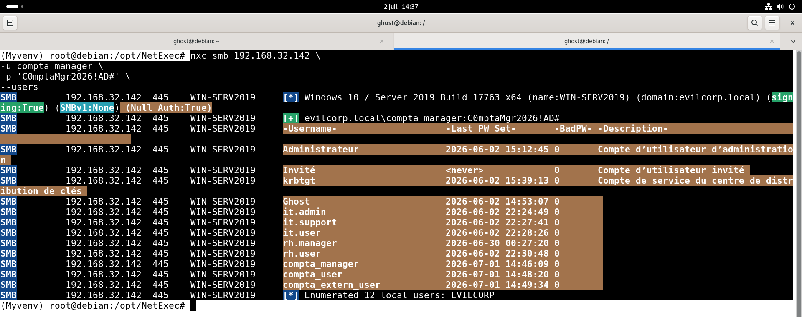
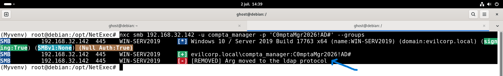
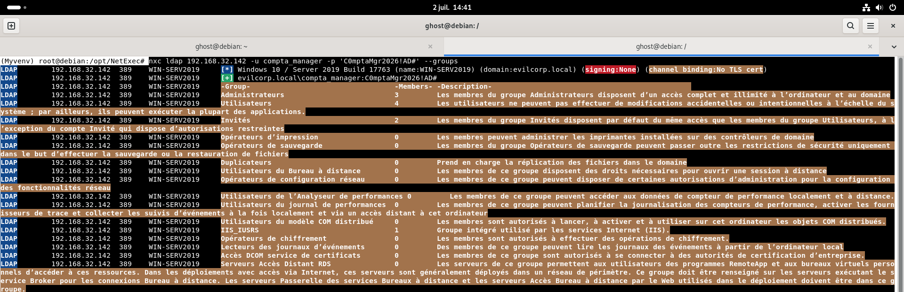
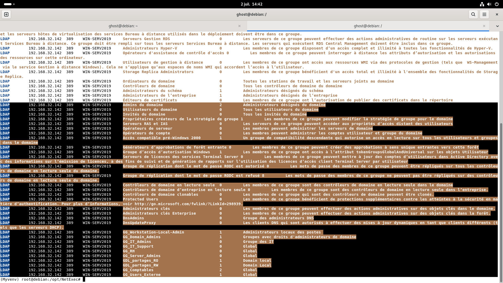
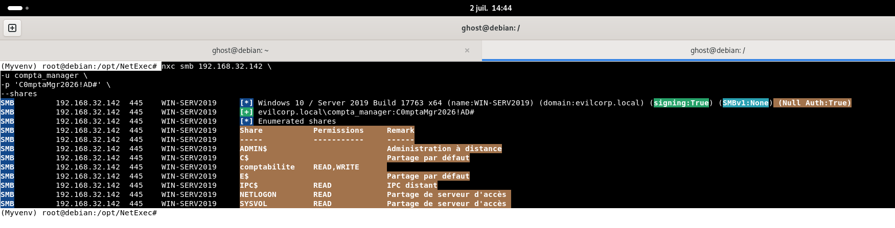
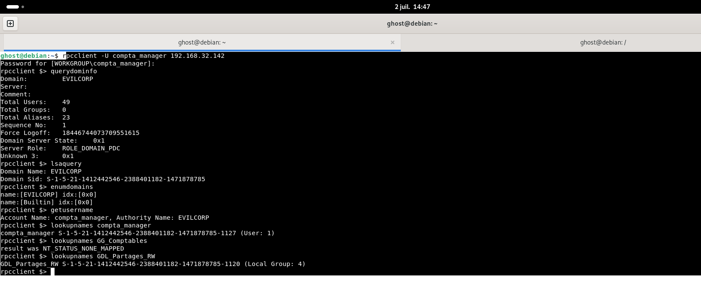

# 03 - Domain Enumeration

## 📖 Objectif

Cette étape consiste à énumérer les informations du domaine **Active Directory** à l'aide d'un compte authentifié. L'objectif est d'identifier les utilisateurs, les groupes de sécurité, les partages accessibles ainsi que les informations générales du domaine afin de mieux comprendre son organisation.

---

## 🎯 Objectifs de cette étape

- Identifier les utilisateurs du domaine.
- Identifier les groupes de sécurité.
- Vérifier les partages accessibles.
- Récupérer les informations du domaine.
- Identifier les SID des objets Active Directory.

---

# 🎯 Cible

| Élément | Valeur |
|---------|--------|
| Adresse IP | 192.168.32.142 |
| Nom d'hôte | WIN-SERV2019 |
| Domaine | evilcorp.local |
| Compte utilisé | compta_manager |

---

# 🔍 Énumération des utilisateurs

L'énumération des utilisateurs est réalisée avec **NetExec**.

```bash
nxc smb 192.168.32.142 \
-u compta_manager \
-p '********' \
--users
```

### Utilisateurs découverts

| Utilisateur |
|-------------|
| Administrateur |
| Invité |
| krbtgt |
| Ghost |
| it.admin |
| it.support |
| it.user |
| rh.manager |
| rh.user |
| compta_manager |
| compta_user |
| compta_extern_user |

Au total, **12 comptes utilisateurs** ont été identifiés.

### Capture



---

# 🔍 Énumération des groupes

Les groupes sont récupérés via le protocole LDAP.

```bash
nxc ldap 192.168.32.142 \
-u compta_manager \
-p '********' \
--groups
```

### Groupes identifiés

#### Groupes intégrés

- Administrateurs
- Utilisateurs
- Invités
- Utilisateurs du Bureau à distance
- IIS_IUSRS
- Lecteurs des journaux d'événements
- ...

#### Groupes créés dans le laboratoire

| Groupe | Type | Membres |
|---------|------|---------|
| GG_Comptables | Global | 2 |
| GG_Users_Externe | Global | 1 |
| GDL_partages_RW | Domain Local | 1 |
| GDL_partages_RO | Domain Local | 1 |

Ces résultats confirment la mise en œuvre du modèle **AGDLP**.

### Capture






---

# 🔍 Énumération des partages

```bash
nxc smb 192.168.32.142 \
-u compta_manager \
-p '********' \
--shares
```

### Partages accessibles

| Partage | Permissions |
|----------|-------------|
| comptabilite | READ, WRITE |
| NETLOGON | READ |
| SYSVOL | READ |
| IPC$ | READ |
| ADMIN$ | Accès restreint |
| C$ | Accès restreint |
| E$ | Accès restreint |

Le compte **compta_manager** dispose bien d'un accès **Lecture / Écriture** sur le partage **comptabilite**, conformément aux permissions configurées.

### Capture





---

# 🔍 Énumération via RPC

Une connexion RPC authentifiée est ensuite utilisée afin de récupérer des informations supplémentaires sur le domaine.

```bash
rpcclient -U compta_manager 192.168.32.142
```

### Informations du domaine

Commande :

```text
querydominfo
```

Résultat :

- Domaine : **EVILCORP**
- Contrôleur principal de domaine (PDC)
- 49 objets utilisateurs
- 23 alias

---

Commande :

```text
lsaquery
```

Résultat :

- Nom du domaine : **EVILCORP**
- SID du domaine récupéré avec succès.

---

Commande :

```text
enumdomains
```

Résultat :

- EVILCORP
- Builtin

---

Commande :

```text
getusername
```

Résultat :

Le compte utilisé est correctement identifié :

```text
EVILCORP\compta_manager
```

---

Commande :

```text
lookupnames compta_manager
```

Résultat :

Le SID de l'utilisateur est correctement résolu.

---

Commande :

```text
lookupnames GDL_Partages_RW
```

Résultat :

Le SID du groupe local de domaine est récupéré avec succès.

---

### Capture



---

# 📝 Analyse Pentest

L'énumération authentifiée permet d'obtenir une vision précise du domaine Active Directory.

Le compte **compta_manager** est capable d'identifier :

- les utilisateurs du domaine ;
- les groupes de sécurité ;
- les partages SMB disponibles ;
- les informations générales du domaine ;
- le SID du domaine ;
- le SID de certains objets Active Directory.

Les permissions appliquées sur le partage **comptabilite** correspondent au modèle **AGDLP** mis en œuvre lors de la phase d'administration.

Les groupes personnalisés (**GG_Comptables**, **GG_Users_Externe**, **GDL_partages_RW** et **GDL_partages_RO**) sont visibles via LDAP, ce qui confirme leur intégration correcte dans le domaine.

# 🛡️ Perspective SOC

> **Note :** Ce laboratoire ne met pas en œuvre de solution de détection SOC (SIEM, EDR, Sysmon, Microsoft Sentinel, Wazuh, Splunk, etc.). Les éléments ci-dessous présentent les opportunités de détection et de surveillance qu'un analyste SOC pourrait exploiter dans un environnement de production.

## Cyber Kill Chain

| Phase | État |
|--------|------|
| Discovery | ✅ |

L'attaquant cherche à identifier les comptes, groupes, SID et ressources du domaine Active Directory.

---

## MITRE ATT&CK

| Tactique | Technique |
|-----------|-----------|
| Discovery | **T1087.002 – Domain Account Discovery** |
| Discovery | **T1069.002 – Domain Groups Discovery** |

---

## Pyramid of Pain

| Niveau | Observation |
|---------|-------------|
| Host Artifacts | Énumération LDAP, RPC et SMB des objets Active Directory. |

---

## Sources potentielles de télémétrie

- Journaux Security
- LDAP Logs
- Sysmon
- SIEM
- EDR

---

## Indicateurs potentiels

- Requêtes LDAP inhabituelles.
- Énumération des comptes utilisateurs.
- Découverte des groupes Active Directory.
- Résolution de SID.

---

## Recommandations

Dans un environnement disposant d'une solution de détection, il serait pertinent de :

- Surveiller les requêtes LDAP volumineuses.
- Détecter l'énumération des groupes du domaine.
- Corréler les requêtes LDAP avec les connexions SMB.

> **Remarque :** La validation de ces mécanismes de détection n'est pas couverte dans ce laboratoire et fera l'objet d'un projet dédié.

---

## ✅ Résultat

À l'issue de cette étape :

- Les principaux utilisateurs du domaine ont été identifiés.
- Les groupes de sécurité ont été découverts.
- Les partages SMB accessibles ont été validés.
- Les informations du domaine et son SID ont été récupérés.
- L'implémentation du modèle **AGDLP** a été confirmée par l'observation des groupes et des permissions.

---

## ➡️ Étape suivante

La prochaine étape consiste à analyser plus en détail le partage **comptabilite** afin de vérifier les permissions effectives, l'accès aux fichiers et la conformité avec le modèle **AGDLP**.

→ **04-SMB-Share-Analysis**
