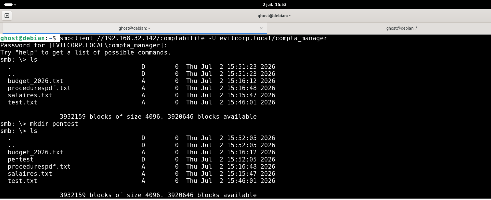
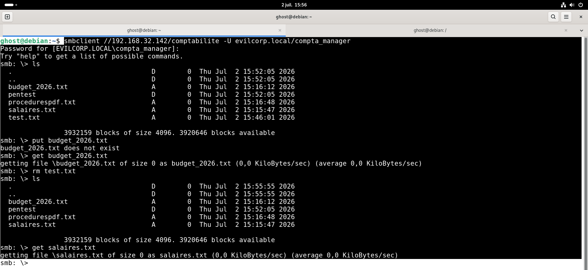
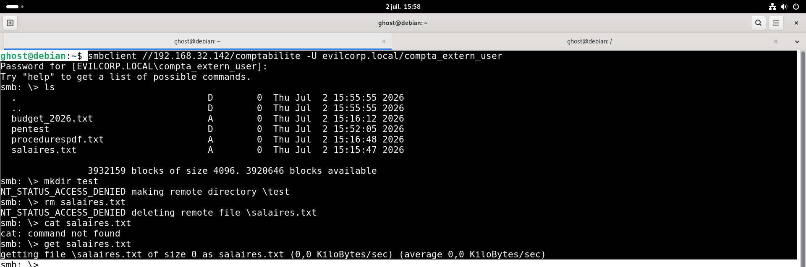

# 04 - SMB Share Analysis

## 📖 Objectif

Cette étape consiste à analyser le partage **SMB** découvert lors de la phase d'énumération afin de vérifier les permissions effectives accordées aux différents utilisateurs du domaine.

L'objectif est de confirmer que les autorisations configurées via le modèle **AGDLP (Accounts → Global Groups → Domain Local Groups → Permissions)** sont correctement appliquées et respectent le principe du moindre privilège.

---

## 🎯 Objectifs de cette étape

- Vérifier l'accès au partage **comptabilite**.
- Contrôler les permissions de lecture.
- Contrôler les permissions d'écriture.
- Contrôler les permissions de suppression.
- Valider l'implémentation du modèle AGDLP.

---

# 🎯 Cible

| Élément | Valeur |
|---------|--------|
| Serveur | WIN-SERV2019 |
| Domaine | evilcorp.local |
| Partage | comptabilite |
| Protocole | SMB |

---

# 🔍 Connexion au partage SMB

La connexion est réalisée avec **SMBClient**.

```bash
smbclient //192.168.32.142/comptabilite \
-U evilcorp.local/compta_manager
```

Une seconde connexion est ensuite réalisée avec **compta_extern_user** afin de comparer les permissions effectives.

---

# 📂 Analyse du contenu

Les deux utilisateurs peuvent lister les fichiers présents dans le partage.

```text
budget_2026.txt
procedurespdf.txt
salaires.txt
pentest/
```

Cette observation confirme que les deux comptes disposent d'un accès en **lecture**.

### Capture



---

# ✍️ Vérification des permissions d'écriture

## Test avec `compta_manager`

Le compte **compta_manager** tente de créer un nouveau dossier.

```text
mkdir pentest
```

### Résultat

Le dossier est créé avec succès.

Le compte dispose donc des permissions **Lecture / Écriture**.

### Capture



---

## Test avec `compta_extern_user`

Le même test est réalisé avec le compte **compta_extern_user**.

```text
mkdir test
```

### Résultat

```text
NT_STATUS_ACCESS_DENIED
```

La création du dossier est refusée.

### Capture



---

# 🗑️ Vérification des permissions de suppression

## Test avec `compta_manager`

```text
rm test.txt
```

### Résultat

Le fichier est supprimé avec succès.

Le compte dispose des permissions de modification.

### Capture


---

## Test avec `compta_extern_user`

```text
rm salaires.txt
```

### Résultat

```text
NT_STATUS_ACCESS_DENIED
```

La suppression est refusée.

### Capture


---

# 📥 Vérification des permissions de lecture

Le téléchargement d'un fichier est réalisé avec le compte **compta_extern_user**.

```text
get salaires.txt
```

### Résultat

Le téléchargement s'effectue avec succès.

Le compte possède uniquement les permissions de **lecture**.

### Capture


---

# 📊 Résumé des permissions

| Action | compta_manager | compta_extern_user |
|---------|:--------------:|:------------------:|
| Lister les fichiers | ✅ | ✅ |
| Télécharger un fichier | ✅ | ✅ |
| Créer un dossier | ✅ | ❌ |
| Supprimer un fichier | ✅ | ❌ |

Les résultats sont conformes aux permissions définies lors de la configuration du partage.

---

# 📝 Analyse Pentest

Les tests réalisés montrent que les permissions appliquées au partage **comptabilite** correspondent aux droits attribués via les groupes Active Directory.

Le compte **compta_manager**, membre du groupe **GG_Comptables**, hérite des permissions **Lecture / Écriture** via le groupe **GDL_partages_RW**.

Le compte **compta_extern_user**, membre du groupe **GG_Users_Externe**, hérite uniquement des permissions de **Lecture** via le groupe **GDL_partages_RO**.

Aucune élévation de privilèges ni mauvaise configuration des permissions n'a été observée.

---

# 🛡️ Analyse SOC

## Cyber Kill Chain

| Phase | État |
|--------|------|
| Discovery | ✅ Terminée |
| Collection | ✅ En cours |

L'attaquant tente désormais d'accéder aux données disponibles sur le partage réseau.

---

## MITRE ATT&CK

| Tactique | Technique |
|-----------|-----------|
| Discovery | T1135 – Network Share Discovery |
| Collection | T1039 – Data from Network Shared Drive |

---

## Pyramid of Pain

| Niveau | Observation |
|---------|-------------|
| Network Artifacts | Accès répétés au partage SMB. |
| Host Artifacts | Création, suppression et téléchargement de fichiers via SMB. |

---

## Sources de journalisation

Les activités peuvent être observées via :

- Journaux Windows Security
- Journaux SMB Server
- Sysmon
- Microsoft Defender for Endpoint
- SIEM

---

## Indicateurs de compromission (IoC)

- Création de nouveaux répertoires sur un partage réseau.
- Suppression de fichiers sur un partage SMB.
- Téléchargement massif de documents.
- Accès inhabituels à des partages sensibles.

---

## Recommandations SOC

- Surveiller les opérations de création et suppression de fichiers sur les partages SMB.
- Générer une alerte lorsqu'un utilisateur tente d'effectuer une action non autorisée.
- Corréler les accès SMB avec les groupes Active Directory afin de détecter d'éventuelles anomalies de permissions.
- Auditer régulièrement les permissions NTFS et les groupes AGDLP.

---

## ✅ Résultat

À l'issue de cette étape :

- Les permissions du partage **comptabilite** ont été validées.
- Les comptes disposant d'un accès **Lecture / Écriture** peuvent créer et supprimer des fichiers.
- Les comptes disposant d'un accès **Lecture seule** ne peuvent ni créer ni supprimer des fichiers.
- Les permissions observées sont conformes au modèle **AGDLP** implémenté dans le laboratoire.

---

## ➡️ Étape suivante

La prochaine étape consiste à vérifier que les permissions observées sur le partage sont cohérentes avec la structure **AGDLP** du domaine et à confirmer que les droits sont hérités des groupes de sécurité.

→ **05-AGDLP-Validation**
